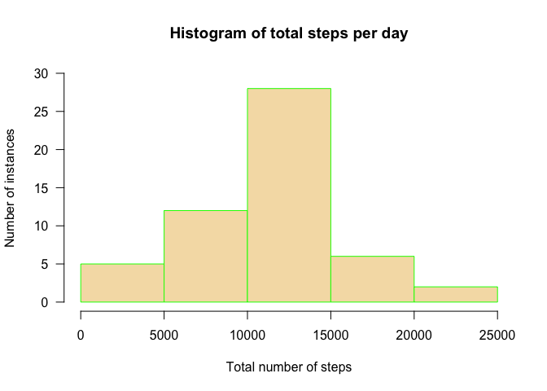

# Reproducible Research: Peer Assessment 1
September 12, 2015  


## Loading and preprocessing the data

```r
activity  <- read.csv("./data/activity.csv", stringsAsFactors = F)
summary(activity)
```

```
##      steps            date              interval     
##  Min.   :  0.00   Length:17568       Min.   :   0.0  
##  1st Qu.:  0.00   Class :character   1st Qu.: 588.8  
##  Median :  0.00   Mode  :character   Median :1177.5  
##  Mean   : 37.38                      Mean   :1177.5  
##  3rd Qu.: 12.00                      3rd Qu.:1766.2  
##  Max.   :806.00                      Max.   :2355.0  
##  NA's   :2304
```


## What is mean total number of steps taken per day?

```r
library("dplyr")
```

```
## 
## Attaching package: 'dplyr'
## 
## The following objects are masked from 'package:stats':
## 
##     filter, lag
## 
## The following objects are masked from 'package:base':
## 
##     intersect, setdiff, setequal, union
```

```r
complete_days_only  <- activity[complete.cases(activity), ]

step_summary  <- complete_days_only %>% group_by(date) %>% summarise(daily_step_count = sum(steps))

hist(step_summary$daily_step_count, 
    main = "Histogram of total steps per day",
    xlab = "Total number of steps",
    ylab = "Number of instances",
    border = "green",
    col = "wheat",
    las = 1,
    ylim = c(0, 30))
```

 


## What is the average daily activity pattern?


## Imputing missing values


## Are there differences in activity patterns between weekdays and weekends?
