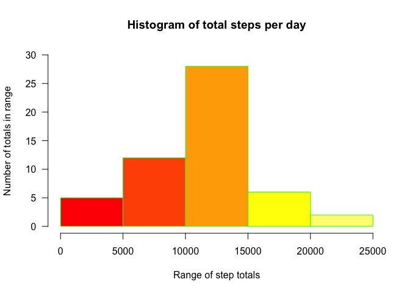
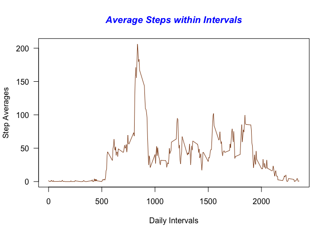
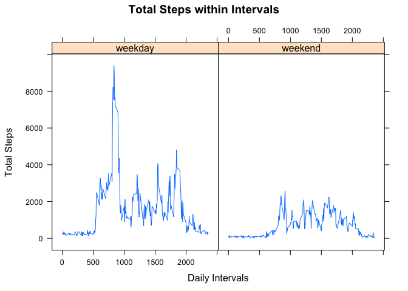

# Reproducible Research: Peer Assessment 1
September 12, 2015  


This assignment makes use of data from a personal activity monitoring
device. This device collects data at 5 minute intervals throughout the
day. The data consists of two months of data from an anonymous
individual collected during the months of October and November, 2012
and include the number of steps taken in 5 minute intervals each day.

## Data

The data for this assignment can be downloaded from the course web
site:

* Dataset: [Activity monitoring data](https://d396qusza40orc.cloudfront.net/repdata%2Fdata%2Factivity.zip) [52K]

The variables included in this dataset are:

* **steps**: Number of steps taking in a 5-minute interval (missing values are coded as `NA`)

* **date**: The date on which the measurement was taken in YYYY-MM-DD format

* **interval**: Identifier for the 5-minute interval in which measurement was taken

The dataset is stored in a comma-separated-value (CSV) file and there are a total of 17,568 observations in this dataset (61 days * 288 time intervals per day).

## Loading and preprocessing the data

The first step in the project, after downloading the data and unpacking it to the local file system, is to read it into R.  Since the data has been provided as a CSV file, the logical method to use would be `read.csv`; *stringsAsFactors* is set to **FALSE** so that dates are not factors but strings that will be converted to dates later.


```r
activity  <- read.csv("./data/activity.csv", stringsAsFactors = F)
```

## What is mean total number of steps taken per day?

The first question to be asked of this dataset is how many total steps were taken in a 24-hour period?  The `dplyr` package will be useful for this and other questions, so loading that library will be the first step.


```r
suppressMessages(library(dplyr))
library("dplyr")
```

Next, since the data contains **NA** values, create a second dataset with those values removed.  To consider only those days for which step counts were recorded, use the `complete.cases` method.


```r
complete_days_only <- activity[complete.cases(activity), ]
```

To perform the analysis required for this part of the assignment, use the `group_by` and `summarise` functions from `dplyr`.  The *sum* can be calculated using `summarise` once the data has been organized by **date** using `group_by`.


```r
step_summary  <-  complete_days_only %>% 
                  group_by(date) %>% 
                  summarise(daily_step_count = sum(steps))
```

Now plot the results for total number of steps taken per day.  The histogram will show the range of totals across the x-axis (from 0 to the maximum number of steps recorded for a single day) while along the y-axis will be shown the number of days that fell within each range (i.e., between 0 and 5000, there were 5 days which had totals in that range).


```r
hist(step_summary$daily_step_count, 
    main = "Histogram of total steps per day",
    xlab = "Range of step totals",
    ylab = "Number of totals in range",
    border = "green",
    col = heat.colors(5),
    las = 1,
    ylim = c(0, 30))
```

 

The mean and median can be easily calculated from the daily totals, and the mean of all the steps over the two-month period is **10766.19** while the median is **10765**.  Two of the many articles presenting the pros and cons of walking 10,000 steps per day are available here: [pros](http://shapeup.org/10000-steps/) and [cons](http://health.usnews.com/health-news/blogs/eat-run/2014/05/21/why-10-000-steps-a-day-wont-make-you-thin). 

## What is the average daily activity pattern?

The next question to answer is within each recorded interval across all days in each of the two months, what was the average number of steps taken in each interval?  To answer this question, `group_by` each interval and then take the *mean* of the steps in each interval.


```r
x  <- complete_days_only %>% 
      group_by(interval) %>% 
      summarise(avg_interval = mean(steps))
```

Plot the results to see the distribution of the averages. The range of intervals will be plotted along the x-axis and the average number of steps for each interval will be plotted along the y-axis.  A time series plot will be used since the data is collected over the course of each day in the month for a 2-month period.


```r
plot(x$interval, 
     x$avg_interval, 
     type = "l", 
     las = 1, 
     col = "chocolate4", 
     main = "Average Steps within Intervals",
     col.main = "blue",
     font.main = 4,
     xlab = "Daily Intervals",
     ylab = "Step Averages"
     )
```

 

So *which* interval had the highest number of average steps?  The `which.max` function answers that easily.

```r
x[which.max(x$avg_interval), ]
```

The highest average number of steps was found in interval **835** and had the value **206.1698113**.

## Imputing missing values

The original dataset contained a certain amount of **NA** values, which were removed prior to doing the previous analyses.  Just how many values in the original dataset were **NA** is easily calculated using the `nrow` function against both the original and reduced datasets.


```r
nrow(activity)
```

```
## [1] 17568
```

```r
nrow(complete_days_only)
```

```
## [1] 15264
```

And so the number of missing observations is the difference between the two, or **2304**.

The presence of missing data for certain days in this time sequence may introduce bias into some calculations or summaries of the data, so it is useful to impute values for those observations in this category.  There are packages in **R** which handle imputations but using a simple random number generator in this case should suffice.

The following code will generate a series of integral values that spans the range of observations in the original dataset, from the minimum to the maximum value.  The entries in this vector will be used as replacement values for the existing **NA** entries in the original dataset.  Using `set.seed` will result in the same set of integers being produced for subsequent runs and support the concept of reproducible research.  The max value is divided by 10 provide reasonable scale to these values, which can get quite large and skew the results in a different way that the missing values can.


```r
set.seed(1234)
z  <- floor(runif(nrow(activity), 
                  min = min(activity$steps, na.rm = T), 
                  max = max(activity$steps, na.rm = T)/10))
```

Next the indices of the missing values are determined.  The use of a separate vector to hold these results rather than include them inline in the mutation code is done for readability.


```r
w  <- which(is.na(activity$steps))
```

Finally, the missing values for the number of steps are replaced with corresponding entries from the integer vector.


```r
activity$steps[w]  <- z[w]
```

How does imputing values for missing data affect the results obtained earlier with the reduced dataset?  The same calculations for total steps per day can be calculated against the augmented dataset and the results plotted via a histogram.


```r
complete_data  <- activity %>% 
                  group_by(date) %>% 
                  summarise(daily_step_count = sum(steps))
```

And here is the plot:


```r
hist(complete_data$daily_step_count, 
    breaks = 10,
    main = "Histogram of total steps per day",
    xlab = "Range of step totals",
    ylab = "Number of totals in range",
    border = "green",
    col = heat.colors(12),
    las = 1,
    ylim = c(0, 25))
```

 

Once again, the mean and median can be easily calculated from the daily totals, and the mean of all the steps over the two-month period is **10858.38** while the median is **11196**.  The imputed data had a negligible affect on both the mean and the median calculated values.  The data did, however, produce a gap in recorded values for the range between 18000 and 20000.

## Are there differences in activity patterns between weekdays and weekends?

Another reasonable question to ask is whether or not the activity level changes based on the day being a weekday or a weekend.  To answer this question, the **date** variable has its values converted to dates.


```r
activity$date <- as.POSIXct(activity$date)
```

Next, in order to separate the data into weekday and weekend subsets for analysis, the **date** variable is input to the `weekdays` method and that output is checked against a vector of weekend day names.  The appropriate text is added as a new column to the dataframe.  This column is then converted to a factor using the `as.factor` method.


```r
activity$dayType  <- ifelse(weekdays(activity$date) %in% c("Saturday", "Sunday"), "weekend", "weekday")
activity$dayType  <- as.factor(activity$dayType)
```

To prepare the data for plotting, the dataset with imputed values is organized first by **dayType** (weekday, weekend) and then by **interval**.  A sum of the steps recorded within those time intervals for each **dayType** is then computed.


```r
q  <- activity %>% 
      group_by(dayType, interval) %>% 
      summarise(daily_step_count = sum(steps))
```

Now that the data is ready for plotting, create a time series plot using the lattice package so that the independent/dependent variables can be conditioned by the factor variable **dayType**.


```r
library(lattice)
with(q, 
      xyplot(daily_step_count ~ interval | dayType, 
      type = "l",      
      main = "Total Steps within Intervals",
      xlab = "Daily Intervals",
      ylab = "Total Steps"))
```

 

It would appear from the output of the graph that this person spent a great deal of time relaxing on the weekends after walking so much during the week!
